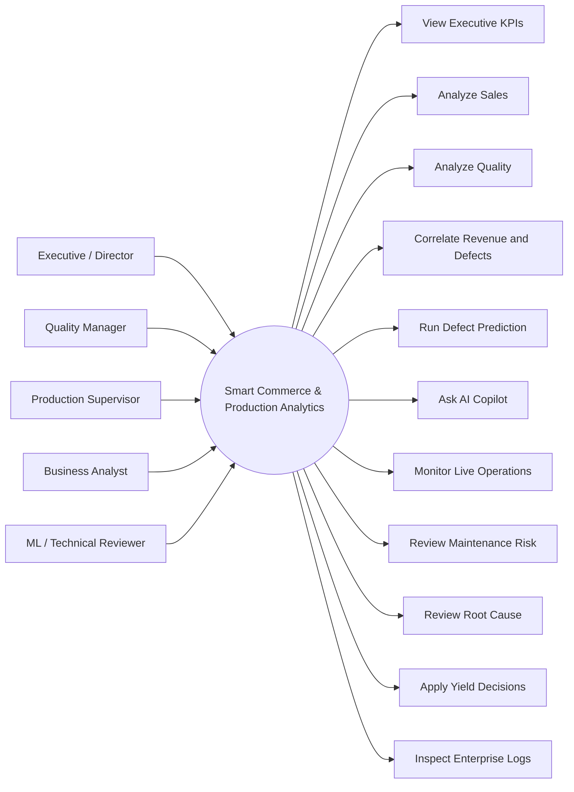
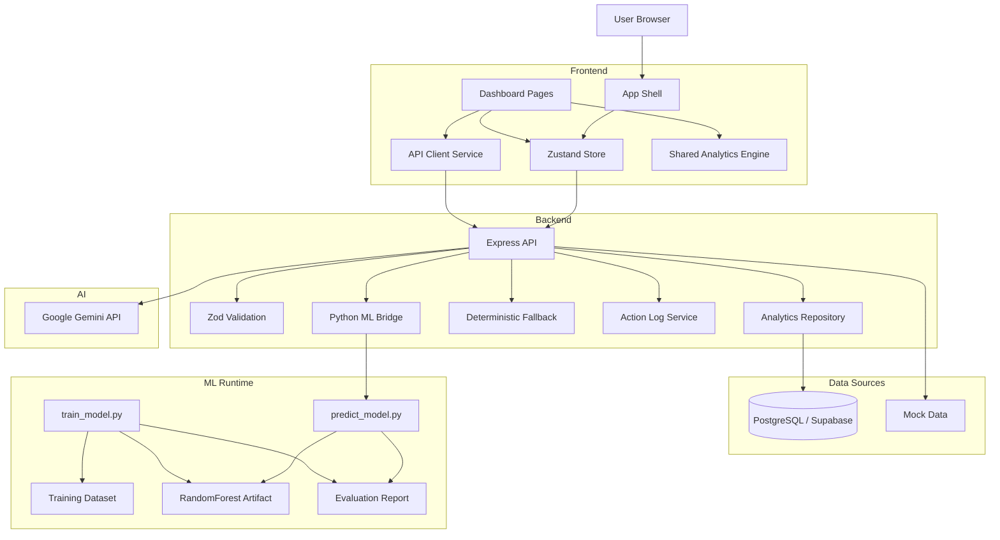
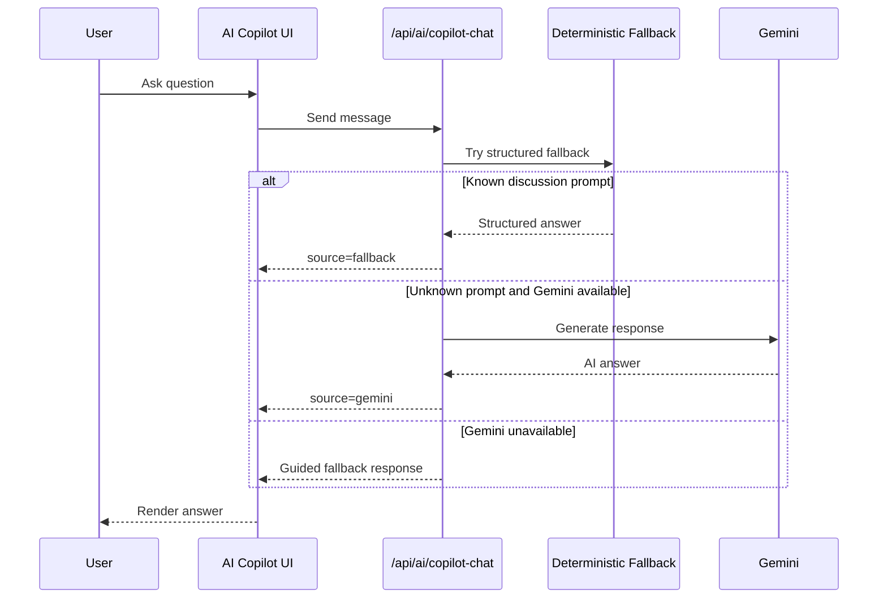

# Smart Commerce & Production Analytics

Full-stack ML and Big Data graduation project that connects sales analytics, production quality analytics, AI assistance, defect prediction, and enterprise-style operational workflows in one system.

## What This Project Is

This project solves a common gap in real organizations: sales teams track revenue, production teams track defects, and both sides often work in separate systems. That separation hides the commercial impact of quality degradation.

This platform brings those domains together in one dashboard so a user can answer questions like:

- Which products generate the most revenue?
- Which production lines create the most defects?
- Which high-selling products are becoming risky because of quality problems?
- Can we predict a defect before a batch is released?
- Can AI explain results and support discussion/demo scenarios?
- How could this architecture scale toward ML operations and Big Data processing?

The system is implemented as a production-style full-stack application with:

- `React + Vite + TypeScript` frontend
- `Express + TypeScript` backend
- `PostgreSQL / Supabase` or deterministic mock data
- `Google Gemini` integration with deterministic fallback
- `Python + scikit-learn` ML training and inference
- Big Data prototype scripts for ETL expansion and batch aggregation

---

## Project Goals

The project was built to demonstrate all of the following in one coherent system:

1. a usable analytics dashboard, not only a model notebook
2. a real backend with validated APIs
3. a real ML prototype with:
   - dataset generation
   - model training
   - exported artifact
   - backend-served inference
   - evaluation report
4. AI-assisted interpretation and discussion support
5. a clear migration path toward enterprise architecture and Big Data workflows

---

## Who Uses It

### Executive / Operations Director

Uses the platform to:

- review total revenue and defect rate
- understand business risk from quality issues
- read AI executive summaries
- inspect enterprise readiness and audit trails

### Quality Manager

Uses the platform to:

- inspect defect rates by production line
- identify products with highest defect rates
- trace likely causes of defect spikes
- review high-risk products that impact revenue

### Production Supervisor

Uses the platform to:

- monitor live telemetry simulation
- inspect anomaly events
- schedule maintenance actions
- issue operational overrides

### Business / Data Analyst

Uses the platform to:

- rank products by revenue
- analyze customer segments
- connect quality signals to commercial results
- review pricing and yield recommendations

### ML / Technical Reviewer

Uses the platform to:

- inspect ML metrics
- test prediction inference
- evaluate how training, artifact serving, and API integration are implemented

---

## Core Functional Modules

## 1. Home Dashboard

The Home page is the executive summary page.

It shows:

- total revenue
- general defect rate
- ML prediction accuracy and F1/precision/recall
- daily revenue trend
- quality by production line
- project readiness state
- AI executive summary

Purpose:
Give one-screen visibility into business health, quality health, and technical readiness.

## 2. Sales Analytics

Focuses on the commercial side of the system.

It shows:

- top products by revenue
- revenue by customer segment

Purpose:
Explain where revenue is coming from and which products are driving business performance.

## 3. Quality Analytics

Focuses on production quality.

It shows:

- defect rate by production line
- highest-defect products

Purpose:
Help users identify where quality issues are concentrated.

## 4. Bridge and Quadrants

This is the most important business page in the project.

It combines sales and quality into one product-level view using a scatter/quadrant model:

- high revenue + low defect: star products
- high revenue + high defect: high-risk products
- low revenue + high defect: low-priority but problematic products
- low revenue + low defect: stable low-impact products

It also generates AI strategic recommendations for the high-risk quadrant.

Purpose:
Translate quality issues into business risk instead of treating them as isolated engineering metrics.

## 5. Defect Prediction

This page is the real ML interaction surface.

The user enters:

- weight
- length
- thickness
- temperature

The frontend sends the request to the backend, the backend calls the Python model runtime, and the system returns:

- probability of defect
- final pass/defect classification
- model source
- AI explanation of the prediction

Purpose:
Demonstrate a real ML inference workflow integrated into a production-style dashboard.

## 6. AI Copilot

Arabic AI discussion assistant.

It supports:

- project overview questions
- ML status questions
- Big Data status questions
- top products questions
- high defect product questions
- line ranking questions
- operational recommendations

It uses:

- deterministic fallback answers for discussion-critical prompts
- Gemini when available for open questions

Purpose:
Keep the project useful in both demo mode and live discussion mode.

## 7. Live IoT Stream

Simulates real-time factory telemetry.

It shows:

- rolling temperature stream
- rolling vibration stream
- latest inference event
- simulated automated actions on anomalies

Purpose:
Represent the streaming analytics story and how the system could evolve toward real-time industrial monitoring.

## 8. Predictive Maintenance

Simulates machine health degradation and failure forecasting.

It provides:

- machine health trend
- current health score
- estimated time to critical threshold
- maintenance action logging

Purpose:
Extend the platform beyond product defects into asset reliability and maintenance planning.

## 9. Root Cause Analysis

Provides a decision-tree style causal exploration view.

It shows:

- defect spike root node
- line-level contributions
- temperature and vibration correlations
- recommended control action

Purpose:
Explain how detected issues can be traced to operational causes.

## 10. Yield Management

Converts combined revenue and quality signals into commercial actions.

The system recommends:

- price increase
- discount or pause
- promotional campaign

Purpose:
Show how analytics can turn into direct business decisions.

## 11. Enterprise Hub

Enterprise-readiness and control surface prototype.

It contains conceptual modules for:

- automations and alerts
- ERP/integration management
- scheduled reports
- team and RBAC
- billing and quotas
- audit logs

Purpose:
Show how the prototype can scale into a platform product, not only a dashboard.

---

## System Architecture

## Frontend Layer

Main responsibilities:

- render dashboard pages
- maintain global state
- call backend services
- display readiness, analytics, and AI/ML results

Key files:

- [src/App.tsx](src/App.tsx)
- [src/store.ts](src/store.ts)
- [src/services/aiService.ts](src/services/aiService.ts)
- [src/components/layout/Sidebar.tsx](src/components/layout/Sidebar.tsx)
- `src/pages/*`

## Backend Layer

Main responsibilities:

- expose REST APIs
- validate payloads with Zod
- select between PostgreSQL and mock data
- integrate Gemini safely from server side
- serve ML inference from Python artifact
- manage action logging

Key files:

- [server.ts](server.ts)
- [src/backend/db.ts](src/backend/db.ts)
- [src/backend/analyticsRepository.ts](src/backend/analyticsRepository.ts)
- [src/backend/mlService.ts](src/backend/mlService.ts)
- [src/backend/copilotFallback.ts](src/backend/copilotFallback.ts)
- [src/backend/actionLog.ts](src/backend/actionLog.ts)
- [src/backend/aiSchemas.ts](src/backend/aiSchemas.ts)
- [src/backend/mlSchemas.ts](src/backend/mlSchemas.ts)

## Data Layer

Two operating modes:

### 1. Database Mode

If `DATABASE_URL` or `SUPABASE_DB_URL` is configured:

- migrations create schema
- seed script inserts project data
- backend reads from PostgreSQL

### 2. Demo Mode

If no database is configured:

- backend falls back to deterministic local mock data

Key files:

- [db/migrations/001_init.sql](db/migrations/001_init.sql)
- [scripts/migrate.ts](scripts/migrate.ts)
- [scripts/seed.ts](scripts/seed.ts)
- [src/lib/mockData.ts](src/lib/mockData.ts)

## AI Layer

The project uses two AI modes:

### Gemini Mode

If `GEMINI_API_KEY` is present and valid:

- backend sends prompts to Gemini
- frontend receives `source: gemini`

### Fallback Mode

If Gemini is unavailable or quota-limited:

- deterministic logic returns discussion-safe answers
- the UI still remains useful

This is implemented so the project never collapses in front of an examiner due to API availability.

## ML Layer

This project includes a real ML prototype path:

1. generate a synthetic supervised dataset
2. train a `RandomForestClassifier`
3. export a `.joblib` artifact
4. export a JSON evaluation report
5. load the artifact from backend inference
6. expose prediction through `POST /api/ml/predict`

Key files:

- [ml/generate_dataset.py](ml/generate_dataset.py)
- [ml/train_model.py](ml/train_model.py)
- [ml/predict_model.py](ml/predict_model.py)
- [ml/artifacts/evaluation_report.json](ml/artifacts/evaluation_report.json)
- [src/backend/mlService.ts](src/backend/mlService.ts)

## Big Data Prototype Layer

This project also includes a Big Data prototype path.

Implemented now:

- dataset expansion ETL script
- 1M-row generation workflow
- batch aggregation pipeline

Future distributed path:

- Kafka for ingestion
- Spark Structured Streaming for processing
- BigQuery for warehousing and dashboard-serving

Key files:

- [bigdata/etl_expand_dataset.py](bigdata/etl_expand_dataset.py)
- [bigdata/batch_aggregate.py](bigdata/batch_aggregate.py)

---

## UML / Architecture Diagrams

GitHub renders Mermaid directly in Markdown, so the diagrams below act as UML-style design references inside the README.

## Use Case Diagram



## High-Level Component Diagram



## AI Copilot Flow



---

## API Surface

## Health and Readiness

- `GET /api/health`
- `GET /api/readiness`
- `GET /api/data`

## ML

- `GET /api/ml/status`
- `POST /api/ml/predict`

## AI

- `POST /api/ai/explain`
- `POST /api/ai/quadrant-insight`
- `POST /api/ai/executive-summary`
- `POST /api/ai/copilot-chat`

## Actions

- `GET /api/actions/log`
- `POST /api/actions/log`
- `POST /api/action`

Detailed endpoint behavior is documented in [docs/api-reference.md](docs/api-reference.md).

---

## Repository Structure

```text
smart-commerce-analytics/
├── src/
│   ├── backend/                 # backend support services
│   ├── components/              # UI layout and shared UI primitives
│   ├── lib/                     # analytics logic, contracts, mock data
│   ├── pages/                   # dashboard feature pages
│   ├── services/                # frontend API client service
│   ├── App.tsx                  # app shell
│   └── store.ts                 # Zustand global state
├── db/
│   └── migrations/              # SQL schema
├── scripts/
│   ├── migrate.ts               # DB migration runner
│   └── seed.ts                  # DB seed runner
├── ml/
│   ├── data/                    # training dataset
│   ├── artifacts/               # model artifact + evaluation report
│   ├── generate_dataset.py
│   ├── train_model.py
│   └── predict_model.py
├── bigdata/
│   ├── etl_expand_dataset.py    # ETL expansion demo
│   ├── batch_aggregate.py       # batch aggregation demo
│   └── output/                  # generated outputs (large raw export ignored)
├── docs/                        # discussion, API, UML, architecture docs
├── server.ts                    # Express entrypoint
├── package.json
└── README.md
```

---

## Setup and Run

## Prerequisites

- `Node.js 20+`
- `Python 3.10+` recommended for ML scripts
- optional `GEMINI_API_KEY` for AI mode
- optional `DATABASE_URL` or `SUPABASE_DB_URL` for PostgreSQL mode

## Install

```bash
npm install
```

## Environment

```bash
cp .env.example .env.local
```

Then configure what you need:

- `GEMINI_API_KEY`
- `DATABASE_URL` or `SUPABASE_DB_URL`
- optional DB tuning values

## Run the App

```bash
npm run dev
```

Default local server:

```text
http://localhost:3000
```

## Build

```bash
npm run build
```

## Production Start

```bash
npm run start
```

---

## Database Workflow

## Apply migrations

```bash
npm run db:migrate
```

## Seed database

```bash
npm run db:seed
```

If no database is configured, the app automatically falls back to deterministic mock data for demo use.

---

## ML Workflow

## Generate dataset

```bash
python3 ml/generate_dataset.py
```

## Train model

```bash
python3 ml/train_model.py
```

Outputs:

- `ml/artifacts/defect_random_forest.joblib`
- `ml/artifacts/evaluation_report.json`

## Run inference through backend

The dashboard uses:

- `POST /api/ml/predict`

which internally calls:

- `src/backend/mlService.ts`
- `ml/predict_model.py`

---

## Big Data Prototype Workflow

## Expand dataset

```bash
python3 bigdata/etl_expand_dataset.py
```

## Run batch aggregation

```bash
python3 bigdata/batch_aggregate.py
```

This demonstrates:

- ETL expansion
- large-volume data preparation
- aggregate generation for analytical serving

The large raw generated CSV is intentionally ignored from git to keep the repository publishable.

---

## Testing and Validation

## Type check

```bash
npm run lint
```

## Unit tests

```bash
npm test
```

Tests currently cover:

- analytics calculations
- AI payload validation
- ML payload validation
- copilot fallback logic

---

## Design and Discussion Documents

- [docs/project-discussion-guide.md](docs/project-discussion-guide.md)
- [docs/discussion-cheat-sheet-ar.md](docs/discussion-cheat-sheet-ar.md)
- [docs/project-plan-uml.md](docs/project-plan-uml.md)
- [docs/service-summary-use-cases-plantuml.md](docs/service-summary-use-cases-plantuml.md)
- [docs/api-reference.md](docs/api-reference.md)
- [docs/presentation-demo-guide.md](docs/presentation-demo-guide.md)

The most detailed architecture and service breakdown is in:

- [docs/service-summary-use-cases-plantuml.md](docs/service-summary-use-cases-plantuml.md)

---

## Current Scope vs Future Scope

## Implemented Now

- full React dashboard
- Express backend
- DB/mock data dual mode
- AI endpoints with Gemini + fallback
- real ML artifact inference
- action logging
- project readiness reporting
- ETL and batch aggregation prototype scripts

## Simulated / Demo-Oriented Features

- live IoT stream
- predictive maintenance degradation
- root-cause tree
- enterprise automation surfaces

## Future Enterprise Path

- real streaming ingestion with Kafka
- distributed processing with Spark
- warehouse serving through BigQuery
- persistent audit storage
- full authentication and RBAC
- real industrial telemetry integration

---

## Why This Project Is Strong as a Graduation Project

Because it is not limited to one narrow track.

It demonstrates:

- frontend engineering
- backend engineering
- API design
- validation and error handling
- ML training and inference integration
- AI-assisted analytics
- business intelligence design
- operations-focused dashboards
- Big Data architectural thinking

It is best described as:

`A full-stack analytics platform with a real ML prototype and a concrete Big Data migration path.`

