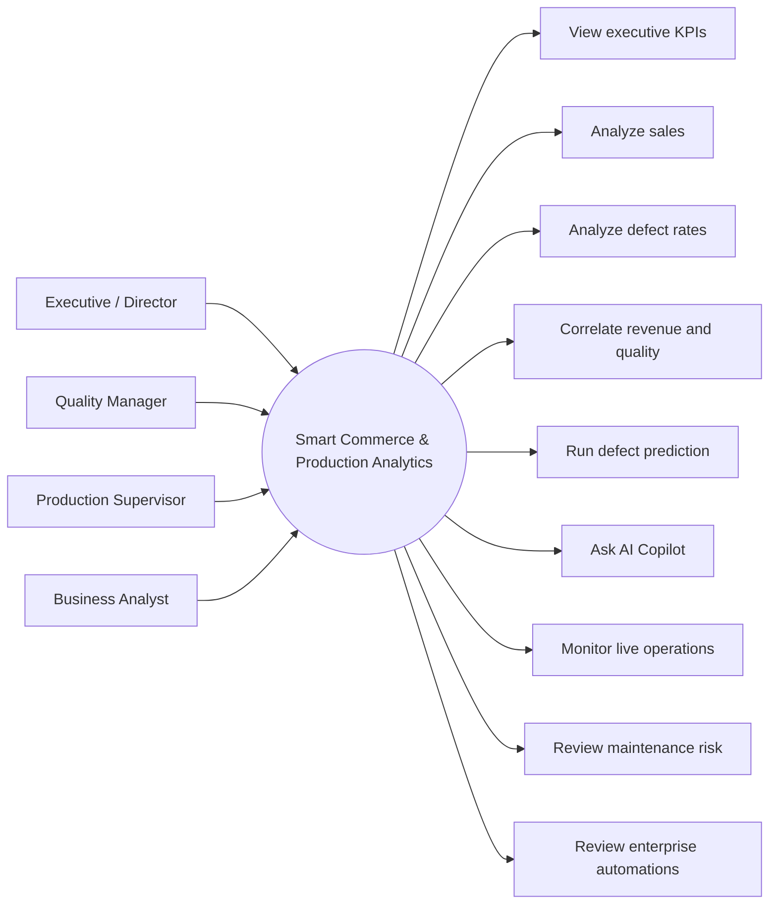
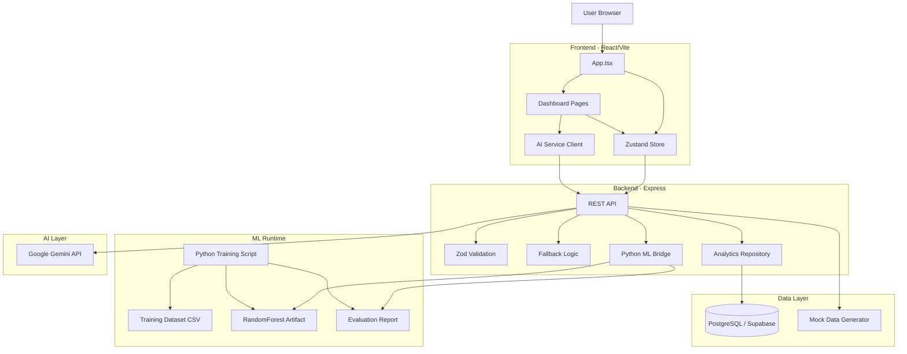
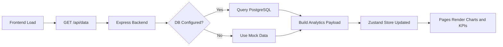
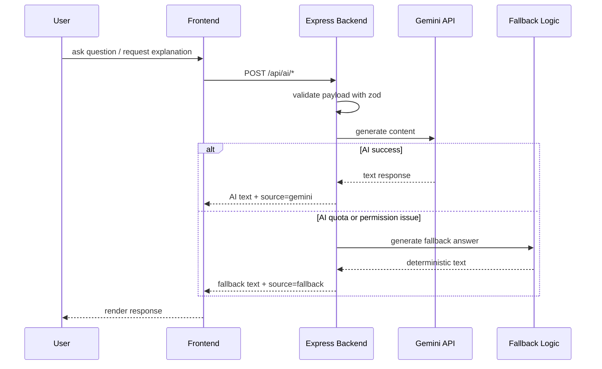
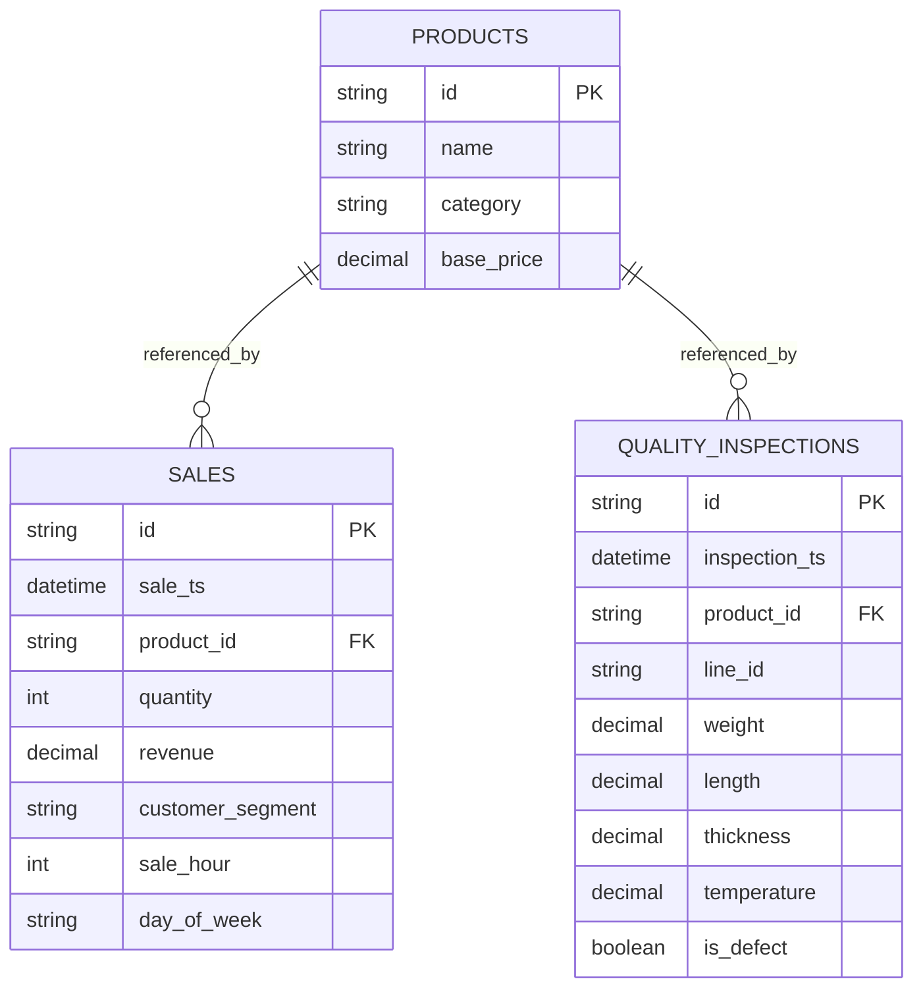
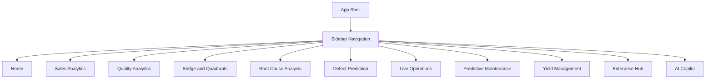
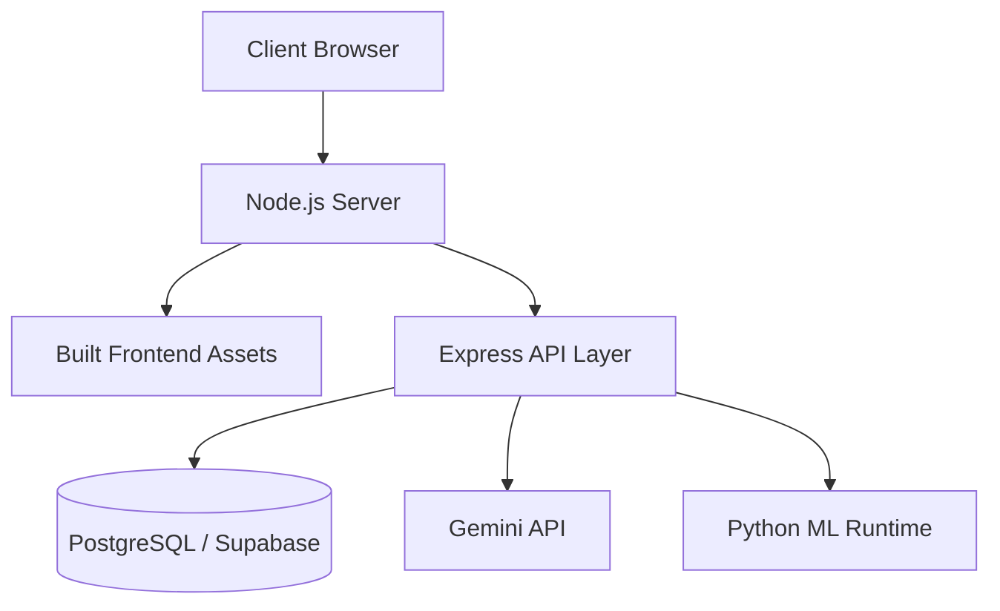
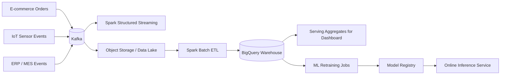

# Smart Commerce & Production Analytics

## Project Plan and UML Pack

This file combines:

- delivery plan
- technical roadmap
- UML and architecture diagrams

The diagrams are written in `Mermaid` so they can be rendered directly in Markdown viewers that support Mermaid.

---

## 1. Delivery Plan

### Phase 1: Foundation

Goal:
Make the current system technically clean and presentation-ready.

Tasks:

- fix TypeScript issues in backend handlers
- remove hardcoded KPIs where possible
- improve loading, empty, and error states
- add `.env.example`
- add test coverage for analytics and API payload validation
- improve README and discussion docs

Expected output:

- stable demo
- cleaner code quality
- stronger graduation-project presentation

### Phase 2: Product Readiness

Goal:
Improve realism and traceability of the platform.

Tasks:

- add action log persistence
- add readiness/health dashboard
- persist user actions from yield management
- improve AI response metadata
- expose actual data-source badge across UI

Expected output:

- stronger operational credibility
- clearer distinction between simulation and real backend features

### Phase 3: Intelligent Operations

Goal:
Move from analytics-only to monitored decision support.

Tasks:

- real-time updates with WebSocket or SSE
- persistent anomaly events
- real maintenance records
- real rule engine for operational actions
- production-grade ML retraining on real datasets

Expected output:

- near-real industrial monitoring experience

### Phase 4: Enterprise Extension

Goal:
Evolve the prototype into a scalable platform concept.

Tasks:

- authentication and RBAC
- audit log system
- external integrations
- distributed Kafka/Spark/BigQuery architecture
- model registry and scheduled retraining

Expected output:

- enterprise-ready architecture path

---

## 2. Use Case Diagram

---

## 3. High-Level Component Diagram

---

## 4. Data Flow Diagram

---

## 5. AI Interaction Sequence

---

## 6. Entity Relationship Diagram

---

## 7. Page Navigation Map

---

## 8. Deployment Diagram

---

## 9. Distributed Next Phase Architecture

---

## 10. Current Technical Status

### Implemented

- multi-page analytics frontend
- backend API layer
- DB schema and seed scripts
- AI integration with fallback handling
- chart-driven analytics views
- trained RandomForest model artifact with backend inference endpoint
- evaluation report for ML metrics
- ETL expansion and batch aggregation demo scripts
- enterprise extension concept pages

### Partially Implemented or Simulated

- live IoT stream is simulated
- predictive maintenance is simulated
- enterprise automations are visual prototypes
- root-cause tree is a conceptual model

### Not Yet Implemented

- authentication
- persistent audit trail
- persistent action engine
- real streaming transport
- distributed warehouse deployment
- real factory data retraining pipeline

---

## 11. Recommended Discussion Language

When discussing the project, use this framing:

- `implemented`
  for features that are fully wired to the current stack

- `simulated to demonstrate architecture`
  for live streaming, predictive maintenance, and some advanced decision flows

- `prototype ML implementation`
  for the trained model built on synthetic labeled data

- `distributed next phase`
  for Kafka, Spark, BigQuery, and large-scale serving architecture

This prevents overclaiming while still presenting a strong technical vision.

---

## 12. Suggested Next Implementation Plan

The best next implementation order is:

1. fix backend TypeScript issues
2. add `.env.example`
3. add project readiness page
4. replace hardcoded KPI values with computed values
5. add tests for analytics and API validation
6. add persistent action log and action history UI
7. add deployment and demo notes

This order improves both code quality and discussion quality quickly.
