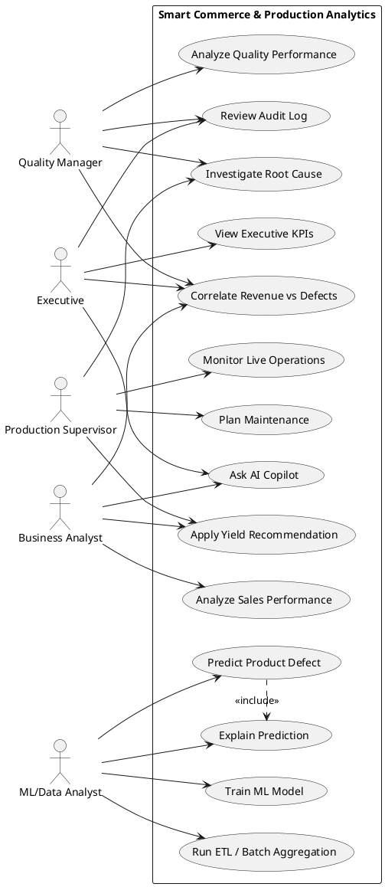
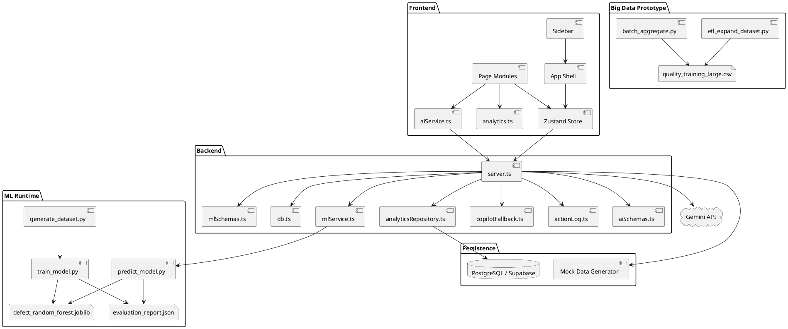
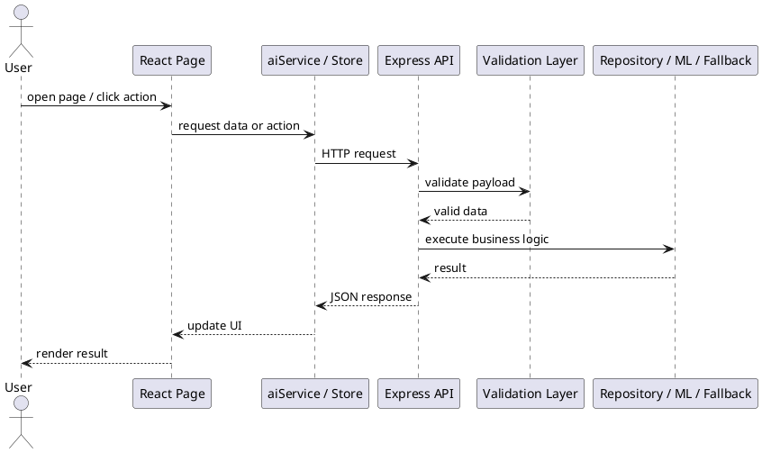
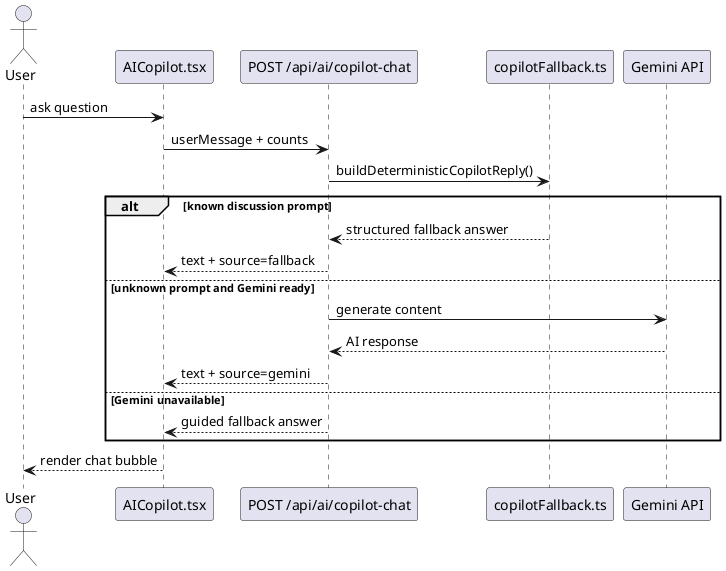
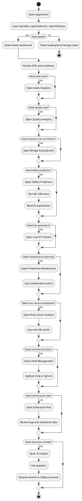
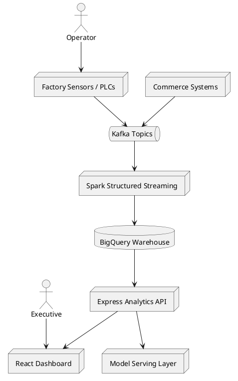

# Smart Commerce & Production Analytics

## Service Summary, Use Cases, PlantUML, and User Workflow

This document is the detailed architecture and functionality reference for the project. It is intended for:

- graduation discussion
- technical viva questions
- architecture explanation
- service-by-service feature walkthrough

---

## 1. System Overview

The project is a full-stack analytics platform that connects:

- commerce data: sales, revenue, customer segments
- production data: inspections, defect rates, line performance
- AI assistance: summaries, explanations, copilot answers
- ML inference: defect probability prediction from production measurements
- Big Data prototype path: ETL expansion and batch aggregation

The main business goal is to stop treating sales analytics and quality analytics as separate worlds. The system helps users see which products make money, which ones are risky, and how operational quality affects commercial results.

---

## 2. Technology Stack

### Frontend

- `React 19`
- `Vite`
- `TypeScript`
- `Zustand`
- `Recharts`
- `Tailwind-style utility classes`
- `Lucide React`

### Backend

- `Express`
- `TypeScript`
- `Zod`
- `helmet`
- `cors`
- `compression`
- `express-rate-limit`

### Data Layer

- `PostgreSQL / Supabase` when configured
- deterministic local `mock data` fallback when database is not configured

### AI and ML

- `Google Gemini` for generative assistance
- deterministic fallback logic when Gemini is unavailable
- `Python + scikit-learn` for model training and inference
- exported `RandomForestClassifier` artifact

### Big Data Prototype

- Python ETL expansion script
- batch aggregation pipeline
- architecture path toward `Kafka + Spark + BigQuery`

---

## 3. Service-by-Service Summary

In this project, "service" includes backend services, frontend service modules, shared analytics modules, and operational scripts that directly support product functionality.

---

## 3.1 Application Shell and Navigation

### `src/App.tsx`

### What it does

This is the frontend shell of the entire product. It controls:

- initial data loading
- readiness and ML status loading
- page routing through local view switching
- lazy loading for dashboard pages
- global loading state
- global error state
- empty-data fallback state
- top status badges for model, data source, and AI mode

### Functionality

- calls `fetchData()` from the Zustand store on startup
- shows loading screen while data is syncing
- shows retry screen if backend calls fail
- shows empty-data screen if neither DB data nor mock data is available
- switches between pages using a sidebar-driven `currentView`
- renders project-level operational badges:
  - model status
  - data source
  - AI mode
  - last sync

### Why it matters

It is the orchestration layer for the user experience. Without it, the pages would exist, but there would be no unified runtime state or navigation.

---

### `src/components/layout/Sidebar.tsx`

### What it does

This is the navigation service for the dashboard workspace.

### Functionality

- lists all major dashboard modules
- handles desktop sidebar mode
- handles mobile drawer mode
- moves the user between functional pages

### Navigation targets

- Home
- Sales Analytics
- Quality Analytics
- Bridge & Quadrants
- Root Cause Analysis
- Defect Prediction
- Live IoT Stream
- Predictive Maintenance
- Yield Management
- Enterprise Hub
- AI Copilot

---

## 3.2 Frontend State Service

### `src/store.ts`

### What it does

This is the global frontend state service built with Zustand.

### Functionality

- stores:
  - `sales`
  - `quality`
  - `products`
  - `productMap`
  - `readiness`
  - `mlReport`
  - `dataSource`
  - `error`
  - `isLoading`
  - `lastLoadedAt`
- loads three backend resources in parallel:
  - `GET /api/data`
  - `GET /api/readiness`
  - `GET /api/ml/status`
- updates the whole dashboard with a single synchronized data fetch

### Why it matters

It centralizes application state so all pages use one consistent source of truth. This avoids per-page duplicated data loading and keeps the UI synchronized.

---

## 3.3 Frontend API Client Service

### `src/services/aiService.ts`

### What it does

This file is the browser-side API client for AI, ML, and action logging endpoints.

### Functionality

- `explainPrediction()`
  - calls `POST /api/ai/explain`
  - gets human-readable explanation for a defect prediction

- `generateQuadrantInsight()`
  - calls `POST /api/ai/quadrant-insight`
  - gets strategic action plan for high-risk products

- `generateExecutiveSummary()`
  - calls `POST /api/ai/executive-summary`
  - gets short leadership summary of KPIs

- `copilotChat()`
  - calls `POST /api/ai/copilot-chat`
  - powers the AI Copilot page

- `createActionLog()`
  - calls `POST /api/actions/log`
  - persists user-triggered operational actions

- `fetchActionLogs()`
  - calls `GET /api/actions/log`
  - reads existing runtime action logs

- `predictDefectWithModel()`
  - calls `POST /api/ml/predict`
  - sends production measurements to backend ML inference

- `fetchMLStatus()`
  - calls `GET /api/ml/status`
  - loads artifact/report availability and evaluation metrics

### Why it matters

This module isolates HTTP details from UI components. Pages can request business operations without duplicating `fetch` logic.

---

## 3.4 Shared Analytics Service

### `src/lib/analytics.ts`

### What it does

This file is the core analytics engine for frontend calculations. It contains deterministic business logic used across multiple pages.

### Functionality

- `evaluateDefectRisk(inputs)`
  - heuristic risk scoring fallback for defect probability

- `calculateHomeKpis(sales, quality)`
  - total revenue
  - total defect count
  - overall defect rate
  - daily revenue trend

- `calculateModelMetrics(quality)`
  - heuristic evaluation metrics from inspection data

- `calculateRevenueByProduct(sales, productMap)`
  - ranks products by revenue

- `calculateRevenueBySegment(sales)`
  - groups revenue by customer segment

- `calculateDefectRateByLine(quality)`
  - calculates defect rate per production line

- `calculateProductDefectRates(quality, productMap, minimumSamples)`
  - ranks products by defect rate, filtered by sample threshold

- `calculateBridgeInsights(sales, quality, productMap)`
  - joins commercial and quality signals
  - computes:
    - revenue
    - defect rate
    - risk score
    - average revenue
    - average defect rate
    - high-risk products
    - star products

- `calculateYieldRecommendations(sales, quality, productMap)`
  - derives pricing and yield actions:
    - increase price
    - discount or pause
    - promo campaign

### Why it matters

This is the mathematical core of the dashboard. Many visible charts and recommendations depend directly on this module.

---

## 3.5 Mock Data Service

### `src/lib/mockData.ts`

### What it does

This service generates deterministic demo data when no real database is configured.

### Functionality

- defines `PRODUCTS`
- defines `PRODUCTION_LINES`
- defines `CUSTOMER_SEGMENTS`
- generates:
  - `5200` sales records
  - `4200` quality inspection records
- creates realistic defect distributions using synthetic logic:
  - line-based defect bias
  - temperature effect
  - thickness effect
  - product-specific defect bias
- exports:
  - `MOCK_SALES`
  - `MOCK_QUALITY`
  - `PRODUCT_MAP`

### Why it matters

This makes the project demoable without database dependency. It is essential for local development, presentation stability, and discussion mode.

---

## 3.6 Backend HTTP Orchestration Service

### `server.ts`

### What it does

This is the main backend entrypoint and orchestration service.

### Responsibilities

- loads environment variables
- initializes Gemini client when API key exists
- configures Express middleware
- configures rate limiting
- exposes all REST endpoints
- serves Vite middleware in development
- serves built frontend assets in production
- performs global error handling

### Middleware and platform hardening

- `helmet`
- `cors`
- `compression`
- `express.json`
- API rate limiting
- AI endpoint-specific rate limiting

### Main API endpoints

#### Project and data endpoints

- `GET /api/health`
  - service health metadata

- `GET /api/readiness`
  - readiness payload for:
    - environment
    - data source
    - DB status
    - AI status
    - model status
    - last sync
    - record counts

- `GET /api/data`
  - returns:
    - sales
    - quality
    - products
    - productMap
    - source

#### Action log endpoints

- `GET /api/actions/log`
  - returns current runtime action log

- `POST /api/actions/log`
  - creates a structured action log entry

- `POST /api/action`
  - generic action endpoint that also writes system action logs

#### ML endpoints

- `GET /api/ml/status`
  - returns whether artifact and metrics exist
  - returns evaluation report if available

- `POST /api/ml/predict`
  - validates inputs
  - attempts Python model inference
  - falls back to heuristic scoring if Python inference fails

#### AI endpoints

- `POST /api/ai/explain`
  - explains one defect prediction

- `POST /api/ai/quadrant-insight`
  - generates action plan for risky products

- `POST /api/ai/executive-summary`
  - summarizes KPI state for executives

- `POST /api/ai/copilot-chat`
  - powers the AI Copilot
  - uses deterministic reply layer first
  - uses Gemini if prompt is not covered
  - returns guided fallback when Gemini is unavailable

### Why it matters

This is the central runtime of the platform. All frontend intelligence and backend integrations flow through it.

---

## 3.7 Database Connectivity Service

### `src/backend/db.ts`

### What it does

This service manages database connectivity.

### Functionality

- reads `DATABASE_URL` or `SUPABASE_DB_URL`
- exposes `hasDatabaseConfig`
- creates PostgreSQL pool
- provides shared `query()` helper
- provides `closePool()` for cleanup in scripts

### Why it matters

It abstracts low-level DB connection management so repository and migration code can stay clean.

---

## 3.8 Analytics Repository Service

### `src/backend/analyticsRepository.ts`

### What it does

This module reads analytics entities from PostgreSQL and maps them into frontend-friendly shapes.

### Functionality

- `fetchProducts()`
  - loads product master data

- `fetchSales()`
  - loads sales events ordered by timestamp

- `fetchQualityInspections()`
  - loads inspections ordered by timestamp

### Why it matters

It is the persistence adapter between relational storage and the application’s analytics payload shape.

---

## 3.9 ML Runtime Bridge Service

### `src/backend/mlService.ts`

### What it does

This service bridges the Node backend to the Python ML runtime.

### Functionality

- resolves paths to:
  - model artifact
  - evaluation report
  - prediction script

- `getMLStatusReport()`
  - checks whether artifact and report exist
  - reads evaluation JSON when available

- `runMLInference(payload)`
  - spawns Python process
  - pipes input JSON to `ml/predict_model.py`
  - reads stdout result
  - returns structured prediction object

### Why it matters

It allows the dashboard to use a real trained model without rewriting the model pipeline in TypeScript.

---

## 3.10 AI Schema Validation Service

### `src/backend/aiSchemas.ts`

### What it does

This service defines Zod schemas for AI request payload validation.

### Functionality

- validates explain requests
- validates quadrant insight requests
- validates executive summary requests
- validates copilot chat requests

### Why it matters

It protects AI endpoints from malformed input and keeps backend contracts explicit.

---

## 3.11 ML Schema Validation Service

### `src/backend/mlSchemas.ts`

### What it does

This file validates ML prediction input payloads.

### Functionality

- ensures the prediction request contains valid numeric features before backend inference runs

### Why it matters

It protects the ML service from invalid input and makes the API testable.

---

## 3.12 Deterministic Copilot Fallback Service

### `src/backend/copilotFallback.ts`

### What it does

This service is the discussion-oriented fallback intelligence layer for the AI Copilot.

### Functionality

It recognizes known prompts and returns structured answers for:

- project overview
- summary of results
- top products
- highest defect products
- production line ranking
- revenue improvement recommendations
- ML status
- Big Data status
- architecture summary

### Why it matters

This is one of the most discussion-critical services in the project. It ensures the copilot remains useful even if Gemini is unavailable, quota-limited, or permission-denied.

---

## 3.13 Action Logging Service

### `src/backend/actionLog.ts`

### What it does

This service stores operational action records in memory during runtime.

### Functionality

- `listActionLogs()`
  - returns action log feed in reverse chronological order

- `appendActionLog(entry)`
  - writes a new log entry
  - stamps:
    - generated ID
    - creation timestamp
  - trims history to the latest 100 entries

### Why it matters

It converts several dashboard actions from static buttons into traceable operational events.

---

## 3.14 Frontend Feature Pages

Each page is effectively a user-facing feature service.

---

### `src/pages/Home.tsx`

### What it does

Executive landing page and operational summary dashboard.

### Functionality

- shows:
  - total revenue
  - defect rate
  - ML accuracy
  - system health card
  - daily revenue trend
  - quality by line
  - project readiness section
  - AI executive summary

- fetches AI executive summary through backend AI service
- refreshes summary when KPI inputs change

### Primary value

Provides a one-screen explanation of commercial state, quality state, readiness state, and AI/ML state.

---

### `src/pages/Sales.tsx`

### What it does

Sales analytics page.

### Functionality

- top 10 products by revenue
- revenue by customer segment

### Primary value

Helps business users identify where money is coming from and which products dominate revenue.

---

### `src/pages/Quality.tsx`

### What it does

Quality analytics page.

### Functionality

- defect rate by production line
- top products with highest defect rates

### Primary value

Helps quality teams locate operational weak points.

---

### `src/pages/Bridge.tsx`

### What it does

The bridge page correlates commerce and quality at product level.

### Functionality

- scatter chart of revenue vs defect rate
- quadrant logic:
  - high revenue + high defects
  - high revenue + low defects
  - low revenue + high defects
  - low revenue + low defects
- high-risk alert cards
- AI strategic action plan for risky products

### Primary value

This page is the core business differentiator of the project. It turns quality issues into revenue-risk decisions.

---

### `src/pages/Model.tsx`

### What it does

Interactive ML prediction page.

### Functionality

- accepts production measurements:
  - weight
  - length
  - thickness
  - temperature
- calls backend ML prediction endpoint
- displays:
  - probability
  - pass/defect decision
  - threshold
  - model source
- calls AI explanation endpoint for narrative reasoning
- shows evaluation report metrics if available

### Primary value

Demonstrates a real ML-backed inference workflow integrated into the dashboard.

---

### `src/pages/AICopilot.tsx`

### What it does

Arabic AI copilot and discussion assistant page.

### Functionality

- chat interface with user/assistant message threads
- quick prompts for viva-ready questions
- discussion opener message
- AI/fallback source labels
- quick recommendations shortcut

### Primary value

Supports analysis and discussion mode directly inside the product.

---

### `src/pages/LiveOperations.tsx`

### What it does

Simulated real-time telemetry and anomaly dashboard.

### Functionality

- generates synthetic sensor stream every 2 seconds
- tracks:
  - temperature
  - vibration
- creates latest inference event
- marks event as pass or defect
- shows automated actions when anomaly conditions are met

### Primary value

Represents the streaming analytics story and the transition toward real-time operations.

---

### `src/pages/PredictiveMaintenance.tsx`

### What it does

Machine degradation and maintenance planning page.

### Functionality

- simulates historical and forecast machine health
- identifies current health percentage
- estimates days until critical threshold
- lets the user:
  - schedule preventive maintenance
  - order spare parts
- logs actions into runtime action log

### Primary value

Expands the platform from product analytics into asset reliability analytics.

---

### `src/pages/RootCauseAnalysis.tsx`

### What it does

Decision-tree-style root cause exploration page.

### Functionality

- navigable cause tree
- node-based explanation panel
- highlights thermal anomaly as critical cause
- offers PLC override action
- logs override request

### Primary value

Explains how operators can move from anomaly detection to cause isolation and action.

---

### `src/pages/YieldManagement.tsx`

### What it does

Commercial action recommendation page.

### Functionality

- computes product recommendations from:
  - revenue
  - defect rate
  - risk score
  - base price
- suggests actions:
  - pricing update
  - discount/pause
  - promotion
- supports:
  - apply pricing
  - ignore
- logs actions

### Primary value

Shows how analytics can translate into monetization and margin protection actions.

---

### `src/pages/EnterpriseHub.tsx`

### What it does

Enterprise expansion and administrative operations page.

### Functionality

Six tabs:

1. `Automations & Alerts`
   - rule engine examples
   - trigger/action patterns

2. `ERP & Integrations`
   - SAP
   - Salesforce
   - Slack
   - custom webhooks

3. `Scheduled Reports`
   - downloadable report examples
   - recurring report concept

4. `Team & RBAC`
   - user list
   - role overview
   - admin operations concept

5. `Billing & Quotas`
   - API usage
   - AI usage
   - scale request

6. `Security & Audit Logs`
   - renders runtime action log feed

### Primary value

This page demonstrates how the prototype can evolve into an enterprise platform.

---

## 3.15 Database Lifecycle Scripts

### `scripts/migrate.ts`

### What it does

Applies SQL migrations from `db/migrations`.

### Functionality

- checks DB configuration
- reads all `.sql` migration files
- applies them in sorted order
- closes pool safely

---

### `scripts/seed.ts`

### What it does

Seeds the configured database with deterministic project data.

### Functionality

- truncates existing tables
- inserts products
- inserts sales
- inserts quality inspections
- wraps work in transaction

---

## 3.16 ML Pipeline Scripts

### `ml/generate_dataset.py`

### What it does

Generates the synthetic supervised learning dataset used for defect training.

### Functionality

- creates 25,000 rows
- includes features:
  - product_id
  - line_id
  - weight
  - length
  - thickness
  - temperature
  - vibration
  - humidity
  - shift
- computes defect probability from synthetic risk logic

---

### `ml/train_model.py`

### What it does

Trains the production defect model.

### Functionality

- reads CSV dataset
- splits train/test sets
- preprocesses:
  - numeric fields
  - categorical fields
- trains `RandomForestClassifier`
- exports:
  - `defect_random_forest.joblib`
  - `evaluation_report.json`

- evaluation report includes:
  - accuracy
  - precision
  - recall
  - F1
  - ROC AUC
  - confusion matrix
  - classification report

---

### `ml/predict_model.py`

### What it does

Loads the exported model and predicts defect probability from stdin JSON.

### Functionality

- loads artifact
- builds one-row DataFrame
- predicts probability
- reads threshold from evaluation report if present
- prints JSON result for Node backend

---

## 3.17 Big Data Prototype Scripts

### `bigdata/etl_expand_dataset.py`

### What it does

Builds a large synthetic dataset for Big Data demonstration.

### Functionality

- reads ML dataset
- expands it into 40 partitions
- generates about 1,000,000 rows
- adds partition and event identifiers

---

### `bigdata/batch_aggregate.py`

### What it does

Builds batch-level analytical aggregates from the expanded dataset.

### Functionality

- creates line-level aggregate table
- creates product-level risk aggregate table
- computes:
  - inspections
  - average temperature
  - average vibration
  - defect rate

---

## 4. End-to-End Functional Feature List

To avoid missing any feature, this is the complete feature inventory grouped by domain.

### Data and readiness features

- DB or mock data fallback
- readiness endpoint
- model status badge
- AI readiness badge
- last sync time
- record count visibility

### Sales features

- product revenue ranking
- revenue by segment

### Quality features

- line defect ranking
- product defect ranking

### Commerce-quality bridge features

- scatter correlation
- average revenue threshold
- average defect threshold
- high-risk product detection
- star-product detection
- AI strategic advice

### ML features

- dataset generation
- model training
- artifact export
- evaluation report export
- backend inference
- frontend prediction UI
- explanation endpoint

### AI features

- executive summary
- prediction explanation
- quadrant recommendation
- AI copilot
- deterministic Arabic fallback replies

### Operations features

- simulated live telemetry
- anomaly event generation
- predictive maintenance forecast
- root cause node exploration
- yield action recommendations
- action logging

### Enterprise prototype features

- automation rules view
- integrations catalog
- scheduled report catalog
- team/RBAC concept
- billing/quota concept
- audit feed

### Big Data prototype features

- ETL expansion
- 1M-row dataset
- batch aggregation outputs
- migration path toward distributed architecture

---

## 5. Main Use Cases

## 5.1 Executive / Director Use Cases

1. View high-level KPIs on the Home page
2. Read AI executive summary
3. Check if project is in DB mode or demo mode
4. Review high-risk products on Bridge page
5. Ask AI Copilot for project summary and results
6. Inspect usage and enterprise readiness on Enterprise Hub

## 5.2 Quality Manager Use Cases

1. View defect rate by line
2. Find products with highest defect rates
3. Inspect bridge correlation between quality and revenue
4. Explore root-cause tree
5. Trigger corrective action logging
6. Review audit log after interventions

## 5.3 Production Supervisor Use Cases

1. Monitor live telemetry page
2. Watch anomaly state from latest event
3. Review predictive maintenance forecast
4. Schedule maintenance
5. Execute PLC override when critical cause is confirmed

## 5.4 Business Analyst Use Cases

1. Rank products by revenue
2. Compare customer segment revenue
3. See which risky products hurt revenue
4. Generate yield recommendations
5. Use AI Copilot to prepare discussion answers

## 5.5 Data/ML Analyst Use Cases

1. Generate synthetic training dataset
2. Train Random Forest model
3. Export artifact and evaluation report
4. Run backend-served inference
5. Validate whether artifact is active from `/api/ml/status`

---

## 6. User Workflow

This is the practical end-user flow from launch to action.

### Step 1: User opens the application

- `App.tsx` loads
- store calls:
  - `/api/data`
  - `/api/readiness`
  - `/api/ml/status`
- the UI decides whether to show:
  - loading
  - error
  - empty state
  - dashboard

### Step 2: User lands on Home

The user immediately sees:

- total revenue
- overall defect rate
- ML report metrics
- readiness state
- daily revenue trend
- quality by line
- AI executive summary

This gives instant business and operational context.

### Step 3: User explores business performance

On `Sales Analytics`, the user:

- identifies best revenue products
- sees which segment drives most revenue

### Step 4: User explores quality performance

On `Quality Analytics`, the user:

- checks which production line is worst
- checks which products have highest defect rate

### Step 5: User links quality to revenue

On `Bridge & Quadrants`, the user:

- sees product points in revenue-defect space
- identifies high-risk products
- reads AI strategic recommendation

### Step 6: User evaluates ML prediction

On `Defect Prediction`, the user:

- enters sample measurements
- runs prediction
- reads probability and defect/pass result
- reads AI explanation

### Step 7: User monitors operational behavior

On `Live IoT Stream`, the user:

- watches simulated sensor feed
- sees anomaly events
- sees automated action suggestions

### Step 8: User handles maintenance risk

On `Predictive Maintenance`, the user:

- sees degradation forecast
- checks days-to-critical
- schedules maintenance or orders parts

### Step 9: User investigates cause

On `Root Cause Analysis`, the user:

- navigates tree nodes
- sees critical factor explanation
- executes override action if needed

### Step 10: User acts on commercial optimization

On `Yield Management`, the user:

- reviews recommendations
- applies pricing or ignores items
- action is logged

### Step 11: User reviews enterprise operations

On `Enterprise Hub`, the user:

- reviews automations
- reviews integrations
- reviews reporting and RBAC concepts
- checks action logs in audit tab

### Step 12: User asks AI Copilot

On `AI Copilot`, the user:

- asks free-form questions
- uses quick discussion prompts
- gets:
  - deterministic discussion answers
  - Gemini answers if available
  - fallback guided answers otherwise

---

## 7. PlantUML Diagrams

The following diagrams are written in PlantUML so you can copy them into any PlantUML renderer directly.

---

## 7.1 System Use Case Diagram



---

## 7.2 High-Level Component Diagram



---

## 7.3 Backend Request Flow



---

## 7.4 AI Copilot Sequence Diagram



---

## 7.5 ML Inference Sequence Diagram

```plantuml
@startuml
actor User
participant "Model.tsx" as ModelPage
participant "POST /api/ml/predict" as PredictAPI
participant "mlSchemas.ts" as Schema
participant "mlService.ts" as MLService
participant "predict_model.py" as PythonPredictor
file "RandomForest Artifact" as Artifact

User -> ModelPage : enter measurements
ModelPage -> PredictAPI : predict request
PredictAPI -> Schema : validate request
Schema --> PredictAPI : valid payload
PredictAPI -> MLService : runMLInference(payload)
MLService -> PythonPredictor : spawn python process
PythonPredictor -> Artifact : load model
PythonPredictor --> MLService : probability + decision
MLService --> PredictAPI : inference result
PredictAPI --> ModelPage : JSON prediction
ModelPage --> User : show pass/defect + probability
@enduml
```

---

## 7.6 User Workflow Activity Diagram



---

## 7.7 Big Data Future-State Architecture Diagram



---

## 8. Current Scope vs Future Scope

### Already implemented now

- full dashboard shell
- backend API
- project readiness endpoint
- data source fallback
- analytics engine
- AI summaries and explanations
- Arabic discussion copilot
- ML dataset generation
- trained Random Forest artifact
- backend inference endpoint
- evaluation report
- action log feed
- ETL and batch aggregation demo scripts

### Prototype / simulated features

- live IoT stream
- predictive maintenance degradation
- root-cause decision tree
- enterprise automation actions
- enterprise integrations page
- RBAC page
- billing/quotas page

### Planned future distributed architecture

- Kafka event ingestion
- Spark streaming analytics
- warehouse-backed real-time dashboard
- persistent audit storage
- authentication and RBAC enforcement
- true industrial telemetry ingestion

---

## 9. Best Way to Explain the Project in Discussion

Use this short framing:

`This project is a full-stack smart analytics platform that connects sales data, production quality data, AI assistance, and a real ML defect prediction workflow in one dashboard. It already implements a real backend, real API validation, real ML artifact inference, and a Big Data prototype path through ETL and batch aggregation.`

---

## 10. Suggested Oral Summary

`The project solves the separation between business analytics and production analytics. Instead of showing revenue alone or defects alone, it correlates both, predicts defect risk using a trained model, explains results using AI, and provides decision-support pages for maintenance, root cause, yield actions, and enterprise operations.`

